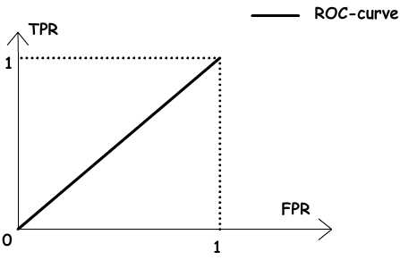
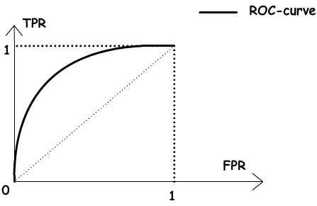

# Вопросы на экзамен

## Список вопросов на экзамен:

1. Ядра и спрямляющие пространства
2. ROC-кривая
3. Нормальный дискриминантный анализ

## Ядра и спрямляющие пространства

## ROC-кривая

> **Кривая ошибок** или **ROC-кривая** – графическая характеристика качества бинарного классификатора, зависимость доли верных положительных классификаций от доли ложных положительных классификаций при варьировании порога решающего правила. Преимуществом ROC-кривой является её инвариантность относительно отношения цены ошибки I и II рода.

### Задача классификации:

 Рассмотрим задачу классификации в случае двух классов, называемых «положительным» и «отрицательным». Обозначим множество классов через $$Y=\{-1,+1\}$$. Большинство известных классификаторов могут быть представлены в виде $$a(x)=sign(f(x,\omega)-\omega_0) $$ , где $$x$$ - произвольный объект, $$f(x,\omega)$$ - дискриминантная функция, $$\omega$$ - вектор параметров, определяемый по обучающей выборке, $$\omega_0$$ - порог. Уравнение $$f(x,\omega) = \omega_0$$определяет разделяющую поверхность.  Примером является линейный классификатор, в котором дискриминантная функция имеет вид скалярного произведения вектора описания объекта на вектор параметров $$a(x)=sign(\langle x,\omega \rangle-\omega_0)$$.

Пусть $$\lambda_y$$ - цена ошибки \(штраф за ошибку\) на объекте класса $$y \in \{-1;+1\}$$

 Для байесовского классификатора при достаточно общих предположениях доказано, что оптимальное значение порога $$\omega_0$$зависит только от соотношения цены ошибок:

$$\omega_0 = \ln{\frac{\lambda_{-1}}  {\lambda_{+1}}}$$,

тогда как оптимальное значение вектора параметров $$\omega$$, наоборот, зависит от выборки и не зависит от цены ошибок. Таким образом, варьирование порога $$\omega_0$$для многих классификаторов эквивалентно варьированию отношения цены ошибок на отрицательных и положительных объектах. На практике цены ошибок зависят от особенностей конкретной задачи \(например, от различных экономических соображений или экспертных оценок\) и могут многократно пересматриваться.

Стоит заметить, что частным случаем линейного байесовского классификатора является логистическая регрессия.

ROC-кривая наглядно представляет, каким будет качество классификации при различных $$\omega_0$$и фиксированном $$\omega$$.

### TPR и FPR:

Пусть задана выборка объектов $$X^m=(x_1, ...,x_m)$$с соответствующими им верными ответами $$y_1, ..., y_m$$. Тогда для классификатора $$a(x)$$можно определить две характеристики качества:

1\) Доля ложных положительных классификаций \(False Positive Rate, FPR\):

 $$FPR(a,X^m)=\Large\frac{\sum^m_{i=1} [a(x_i)=+1] [y_i =-1]}{\sum^m_{i=1} [y_i = -1]}$$ 

2\) Доля верных положительных классификаций \(True Positive Rate, TPR\):

$$TPR(a,X^m)=\Large\frac{\sum^m_{i=1} [a(x_i)=+1] [y_i =+1]}{\sum^m_{i=1} [y_i = +1]}$$  

### ROC-кривая:

ROC-кривая показывает зависимость TPR от FPR при варьировании порога $$\omega_0$$. Она проходит из точки $$(0,0)$$, соответствующей максимальному значению $$\omega_0$$, в точку $$(1,1)$$соответствующую минимальному значению $$\omega_0$$. 

При $$\omega_0 > max_{1=1..m} f(x_i, \omega)$$все объекты классифицируются как отрицательные, и ошибки возникают на всех положительных объектах, $$FPR = 0, TPR = 0$$.

При $$\omega_0 > min_{1=1..m} f(x_i, \omega)$$все объекты классифицируются как отрицательные, и ошибки возникают на всех положительных объектах, $$FPR = 1, TPR = 1$$.

ROC-кривая монотонно не убывает. Чем выше лежит кривая, тем лучше качество классификации.

На рисунке ниже приведена ROC-кривая, соответствующая худшему случаю — алгоритму «случайного гадания».

 

На рисунке 2 изображён общий случай. "Лучший случай" — это кривая, проходящая через точки $$(0,0), (0,1), (1,1)$$.

 

 ROC-кривая может быть вычислена по любой выборке. Однако ROC-кривая, вычисленная по обучающей выборке, является оптимистично смещённой влево-вверх вследствие переобучения. Величину этого смещения предсказать довольно трудно, поэтому на практике ROC-кривую всегда оценивают по независимой тестовой выборке.

#### Плодащь под ROC-кривой AUC:

Площадь под ROC-кривой AUC \(Area Under Curve\) является агрегированной характеристикой качества классификации, не зависящей от соотношения цен ошибок. Чем больше значение AUC, тем «лучше» модель классификации. Данный показатель часто используется для сравнительного анализа нескольких моделей классификации.

### Алгоритм построения ROC-кривой:

Данный алгоритм строит ROC-кривую за $$m$$обращений к дискриминантной функции.

Входные данные:

* Выборка $$X^m$$
* Функция $$f(x,\omega)$$при фиксированном векторе параметров $$\omega$$

Результат:

* $$\{(FPR_i, TPR_i)\}^m_{i=0}$$ - последовательность из $$m$$точек ROC-кривой 
* AUC - площадь под ROC-кривой.

## Нормальный дискриминантный анализ

